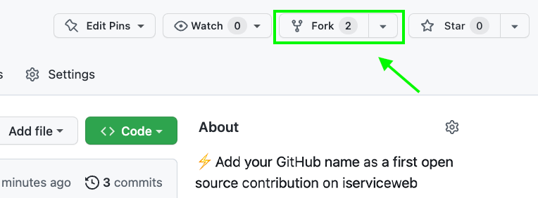
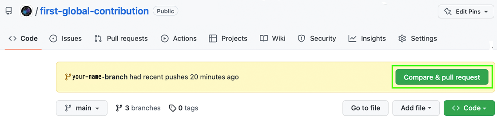

[](https://github.com/radicalx-co/first-global-contribution)
# RadicalX Global Contribution

Radicalx's mission is to give everyone an equal opportunity to learn the skills to become a successful developer. Together we started this GitHub project to help demystify open-source contributions and help you make you're first global contribution. Begin by following each step below. Good Luck!
## Step one: Fork this repository




Fork this repository by clicking on the fork button on the top of this page.This will create a copy of this repository in your own account.
## Step two: Clone the repository you just forked


Now clone the forked repository to your machine. Go to your GitHub account, open the forked repository, click on the `code` button and then click the `copy to clipboard` icon.


## Step Three: Open a terminal and run the following git command:

```
git clone "paste the url you just copied"
```
### Example: 

```
git clone https://github.com/your-github-name/first-global-contribution.git
```
## Step Four: Create a new branch
### Example: 
```
git branch yourname-contribution
```


Switch to the new branch using `git switch` command for example:
```
git switch -c your-new-branch
```
## Step Five: Add changes and commit those changes

Open `GlobalContributions.md` file in a text editor, add your name to it along with your github url and save the file.

### Example: 
```
[john](https://github.com/john989849898)
```

- using the command `git status`, will show you any changes you've made.


- Add those changes using the `git add` command:

```
git add GlobalContributions.md
```
- Now commit those changes using the `git commit` command:

```
git commit -m "Add your-name to Global Contributors list"
```
- Please replacing `your-name` with your actual name.😅


## Step Six: Push changes to GitHub

Push your changes using the command `git push`:

```
git push -u origin your-branch-name
```

- Please replacing `your-branch-name` with the name of the branch you created.😅


## Step Seven: Submit your changes for review

Assuming you followed all the previou steps, Go back to github.com to your forked repository & you should see a `Compare & pull request` button apprear. Click on that green button.



- Add your name and submit the pull request.


- Soon our organization will merge all your changes into the main branch of this project. You will get a notification email once the changes have been successfully merged. Keep in mind that, this my take severl weeks to merge the change.

## Conclusion: All Set! 🎉

You just finished the `fork 👉 clone 👉 edit 👉 pull` request workflow that you'll frequently experience as an open-source contributor!

Share this repo with your friends and followers by going to [radicalx global contribution](https://github.com/radicalx-co/first-global-contribution).

